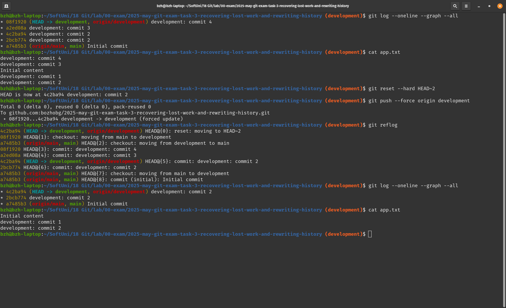
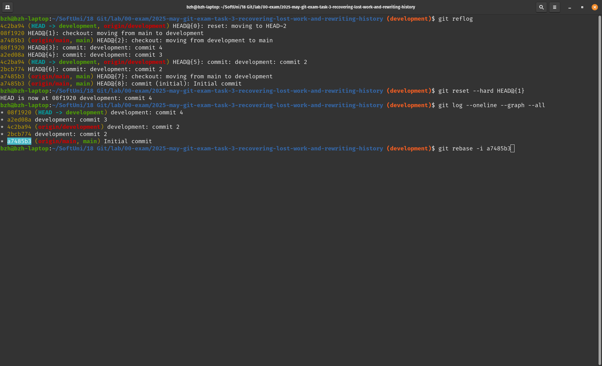
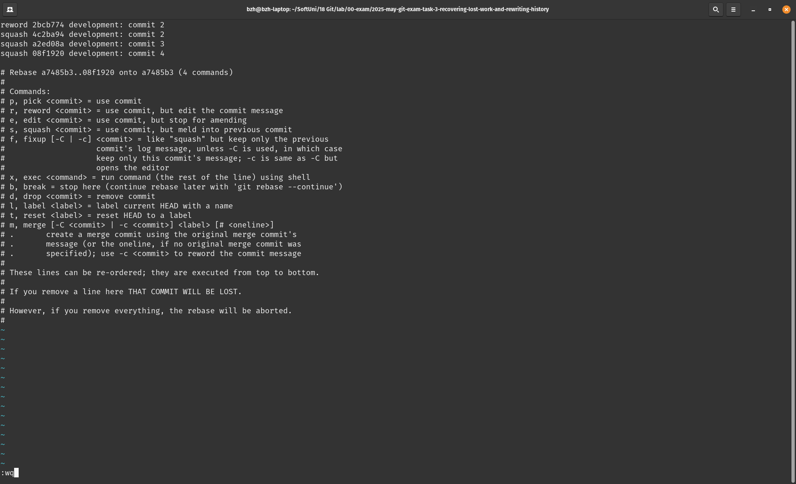
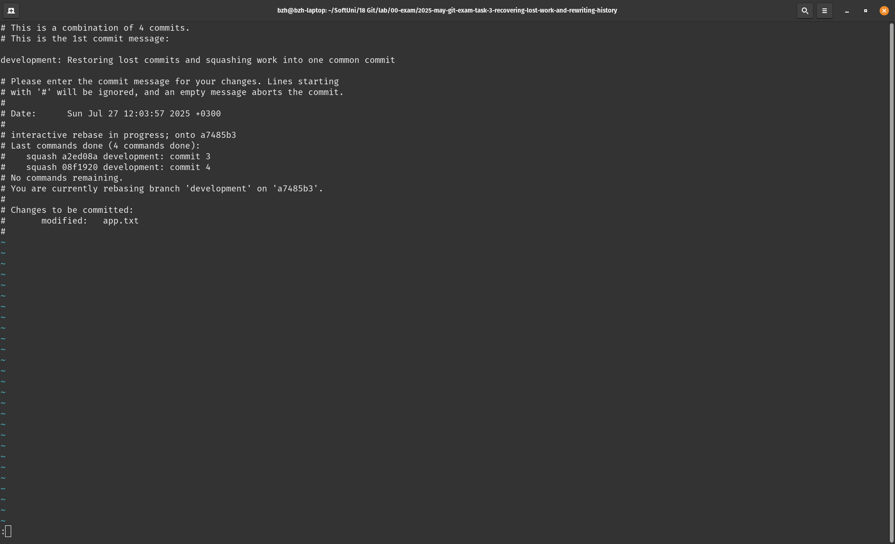
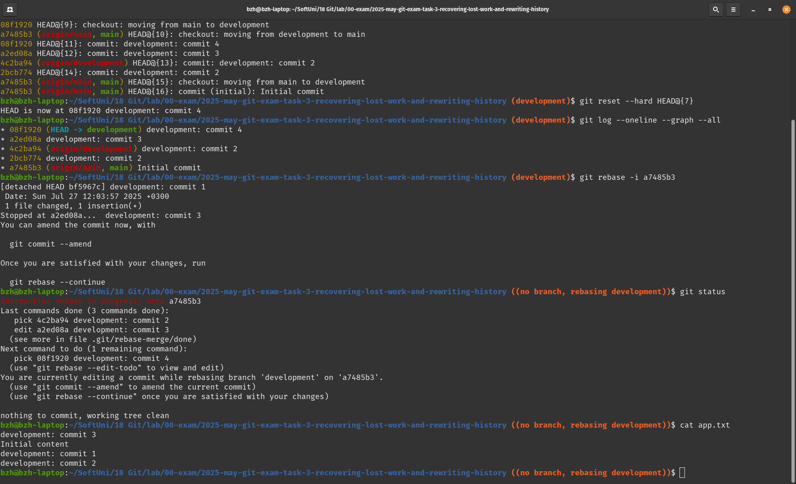
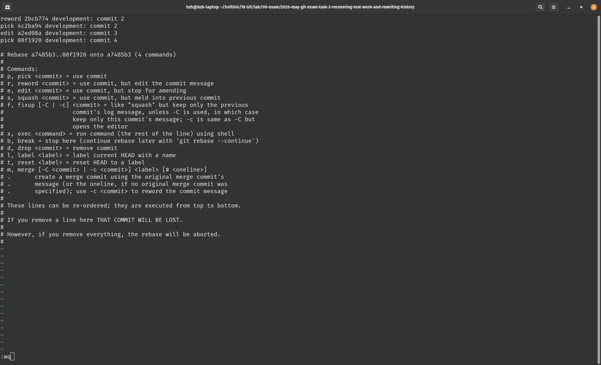
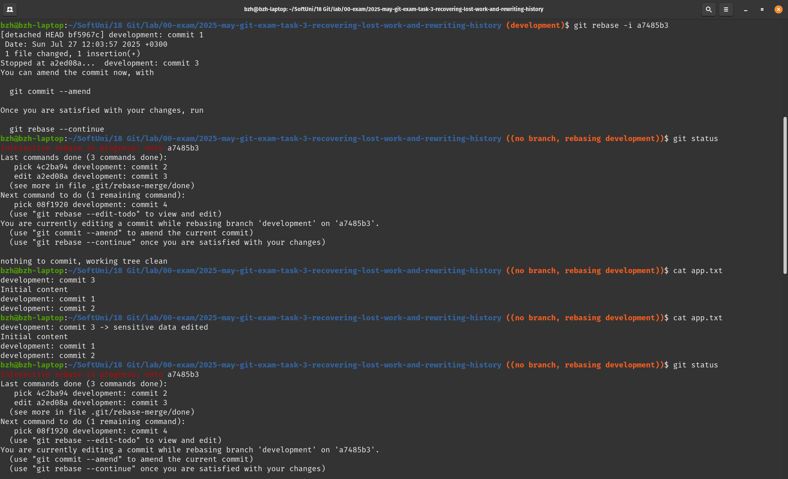
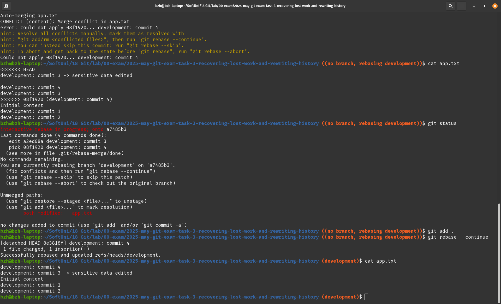
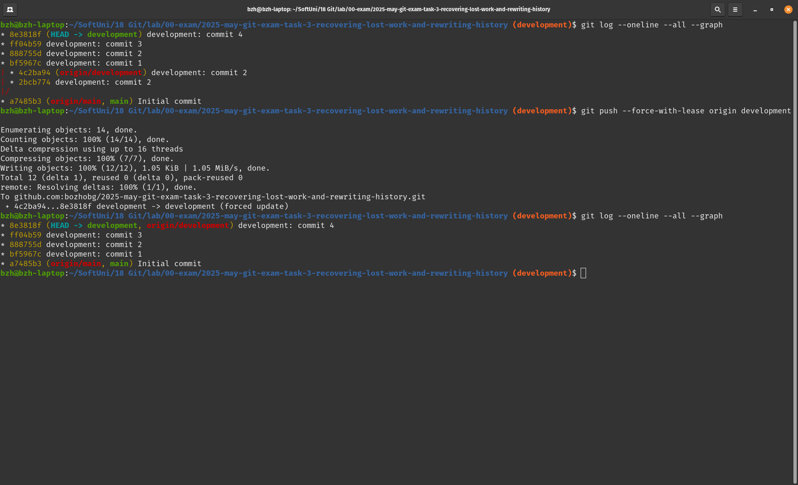
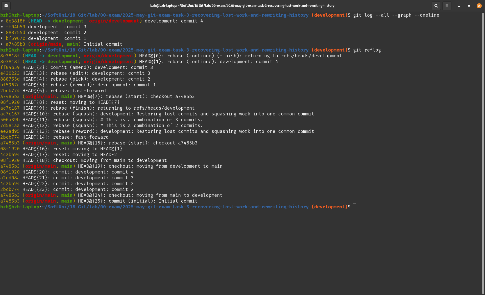

## Recovering Lost Work and Rewriting Git History
1. Initial state local remote with file changes on branch
2. Resetting HEAD~2 and force pushing into remote

3. Restoring lost commits and squashing locally using interactive rebase

4. Restoring lost commits and editing "sensitive data" (using git reflog again)

5. Restoring timeline to remote repo push with lease

6. git log and git reflog
